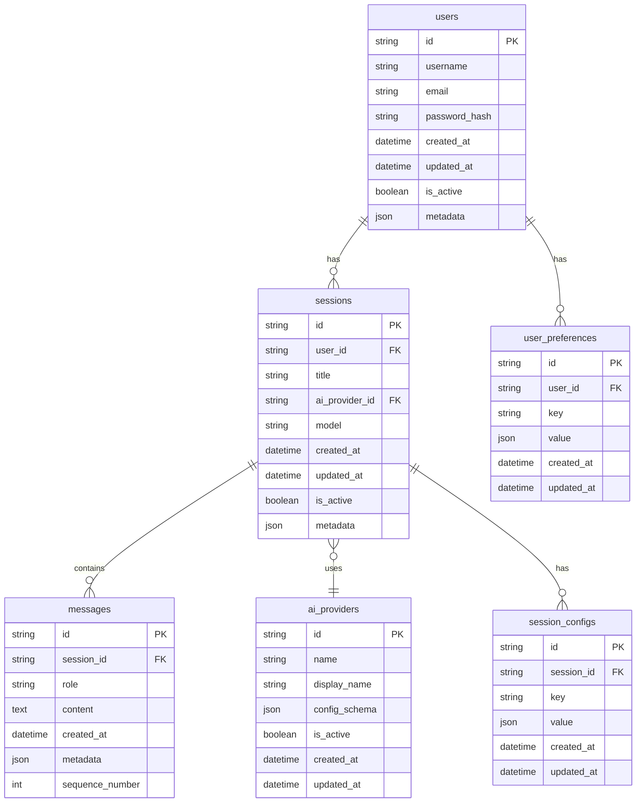

# 数据库设计

## 数据库架构图



## 表结构详细设计

### 1. 用户表 (users)

```sql
CREATE TABLE users (
    id VARCHAR(36) PRIMARY KEY DEFAULT (UUID()),
    username VARCHAR(50) UNIQUE NOT NULL,
    email VARCHAR(100) UNIQUE NOT NULL,
    password_hash VARCHAR(255) NOT NULL,
    created_at TIMESTAMP DEFAULT CURRENT_TIMESTAMP,
    updated_at TIMESTAMP DEFAULT CURRENT_TIMESTAMP ON UPDATE CURRENT_TIMESTAMP,
    is_active BOOLEAN DEFAULT TRUE,
    metadata JSON,
    
    INDEX idx_username (username),
    INDEX idx_email (email),
    INDEX idx_created_at (created_at)
);
```

### 2. AI提供商表 (ai_providers)

```sql
CREATE TABLE ai_providers (
    id VARCHAR(36) PRIMARY KEY DEFAULT (UUID()),
    name VARCHAR(50) UNIQUE NOT NULL,
    display_name VARCHAR(100) NOT NULL,
    config_schema JSON NOT NULL,
    is_active BOOLEAN DEFAULT TRUE,
    created_at TIMESTAMP DEFAULT CURRENT_TIMESTAMP,
    updated_at TIMESTAMP DEFAULT CURRENT_TIMESTAMP ON UPDATE CURRENT_TIMESTAMP,
    
    INDEX idx_name (name),
    INDEX idx_is_active (is_active)
);

-- 初始数据
INSERT INTO ai_providers (name, display_name, config_schema) VALUES
('openai', 'OpenAI', '{"api_key": {"type": "string", "required": true}, "base_url": {"type": "string", "default": "https://api.openai.com/v1"}}'),
('qwen', 'Qwen', '{"api_key": {"type": "string", "required": true}, "base_url": {"type": "string", "required": true}}'),
('dify', 'Dify', '{"api_key": {"type": "string", "required": true}, "base_url": {"type": "string", "required": true}}');
```

### 3. 会话表 (sessions)

```sql
CREATE TABLE sessions (
    id VARCHAR(36) PRIMARY KEY DEFAULT (UUID()),
    user_id VARCHAR(36) NOT NULL,
    title VARCHAR(200) NOT NULL,
    ai_provider_id VARCHAR(36) NOT NULL,
    model VARCHAR(100) NOT NULL,
    created_at TIMESTAMP DEFAULT CURRENT_TIMESTAMP,
    updated_at TIMESTAMP DEFAULT CURRENT_TIMESTAMP ON UPDATE CURRENT_TIMESTAMP,
    is_active BOOLEAN DEFAULT TRUE,
    metadata JSON,
    
    FOREIGN KEY (user_id) REFERENCES users(id) ON DELETE CASCADE,
    FOREIGN KEY (ai_provider_id) REFERENCES ai_providers(id),
    
    INDEX idx_user_id (user_id),
    INDEX idx_ai_provider_id (ai_provider_id),
    INDEX idx_created_at (created_at),
    INDEX idx_is_active (is_active)
);
```

### 4. 消息表 (messages)

```sql
CREATE TABLE messages (
    id VARCHAR(36) PRIMARY KEY DEFAULT (UUID()),
    session_id VARCHAR(36) NOT NULL,
    role ENUM('user', 'assistant', 'system') NOT NULL,
    content TEXT NOT NULL,
    created_at TIMESTAMP DEFAULT CURRENT_TIMESTAMP,
    metadata JSON,
    sequence_number INT NOT NULL,
    
    FOREIGN KEY (session_id) REFERENCES sessions(id) ON DELETE CASCADE,
    
    INDEX idx_session_id (session_id),
    INDEX idx_created_at (created_at),
    INDEX idx_sequence (session_id, sequence_number),
    
    UNIQUE KEY uk_session_sequence (session_id, sequence_number)
);
```

### 5. 用户偏好表 (user_preferences)

```sql
CREATE TABLE user_preferences (
    id VARCHAR(36) PRIMARY KEY DEFAULT (UUID()),
    user_id VARCHAR(36) NOT NULL,
    key VARCHAR(100) NOT NULL,
    value JSON NOT NULL,
    created_at TIMESTAMP DEFAULT CURRENT_TIMESTAMP,
    updated_at TIMESTAMP DEFAULT CURRENT_TIMESTAMP ON UPDATE CURRENT_TIMESTAMP,
    
    FOREIGN KEY (user_id) REFERENCES users(id) ON DELETE CASCADE,
    
    UNIQUE KEY uk_user_key (user_id, key),
    INDEX idx_user_id (user_id)
);
```

### 6. 会话配置表 (session_configs)

```sql
CREATE TABLE session_configs (
    id VARCHAR(36) PRIMARY KEY DEFAULT (UUID()),
    session_id VARCHAR(36) NOT NULL,
    key VARCHAR(100) NOT NULL,
    value JSON NOT NULL,
    created_at TIMESTAMP DEFAULT CURRENT_TIMESTAMP,
    updated_at TIMESTAMP DEFAULT CURRENT_TIMESTAMP ON UPDATE CURRENT_TIMESTAMP,
    
    FOREIGN KEY (session_id) REFERENCES sessions(id) ON DELETE CASCADE,
    
    UNIQUE KEY uk_session_key (session_id, key),
    INDEX idx_session_id (session_id)
);
```

## 索引优化策略

### 1. 查询优化索引

```sql
-- 用户会话列表查询优化
CREATE INDEX idx_user_sessions ON sessions(user_id, is_active, created_at DESC);

-- 会话消息查询优化
CREATE INDEX idx_session_messages ON messages(session_id, sequence_number);

-- 用户活跃度查询优化
CREATE INDEX idx_user_activity ON sessions(user_id, updated_at DESC);
```

### 2. 分区策略

```sql
-- 消息表按月分区（适用于大量数据场景）
ALTER TABLE messages PARTITION BY RANGE (YEAR(created_at) * 100 + MONTH(created_at)) (
    PARTITION p202401 VALUES LESS THAN (202402),
    PARTITION p202402 VALUES LESS THAN (202403),
    -- ... 更多分区
    PARTITION p_future VALUES LESS THAN MAXVALUE
);
```

## 缓存策略

### 1. Redis缓存设计

```python
# 缓存键命名规范
CACHE_KEYS = {
    'user_session': 'user:{user_id}:sessions',
    'session_detail': 'session:{session_id}',
    'session_messages': 'session:{session_id}:messages',
    'user_preferences': 'user:{user_id}:preferences',
    'ai_providers': 'ai_providers:active',
}

# 缓存过期时间
CACHE_TTL = {
    'user_session': 3600,      # 1小时
    'session_detail': 1800,    # 30分钟
    'session_messages': 600,   # 10分钟
    'user_preferences': 7200,  # 2小时
    'ai_providers': 86400,     # 24小时
}
```

### 2. 缓存更新策略

- **写入时更新**: 数据修改时同步更新缓存
- **延迟删除**: 删除操作时立即删除缓存
- **定时刷新**: 定期刷新长期缓存数据
- **缓存预热**: 系统启动时预加载热点数据

## 数据迁移脚本

### 1. 初始化脚本 (scripts/init_db.py)

```python
"""数据库初始化脚本"""

async def init_database():
    """初始化数据库"""
    # 创建表结构
    await create_tables()
    
    # 插入初始数据
    await insert_initial_data()
    
    # 创建索引
    await create_indexes()

async def insert_initial_data():
    """插入初始数据"""
    # 插入AI提供商数据
    providers = [
        {
            'name': 'openai',
            'display_name': 'OpenAI',
            'config_schema': {
                'api_key': {'type': 'string', 'required': True},
                'base_url': {'type': 'string', 'default': 'https://api.openai.com/v1'}
            }
        },
        # ... 更多提供商
    ]
    
    for provider in providers:
        await ai_provider_repo.create(provider)
```

## 性能优化建议

### 1. 查询优化
- 使用适当的索引
- 避免N+1查询问题
- 使用连接查询替代多次单表查询
- 合理使用分页

### 2. 数据归档
- 定期归档历史消息数据
- 保留最近3个月的热数据
- 历史数据迁移到冷存储

### 3. 监控指标
- 数据库连接池使用率
- 慢查询监控
- 缓存命中率
- 表空间使用情况
