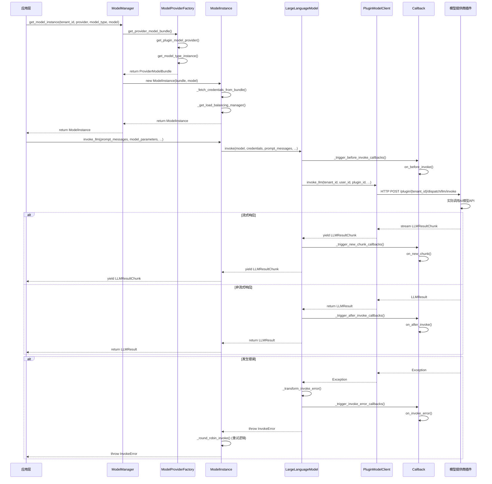
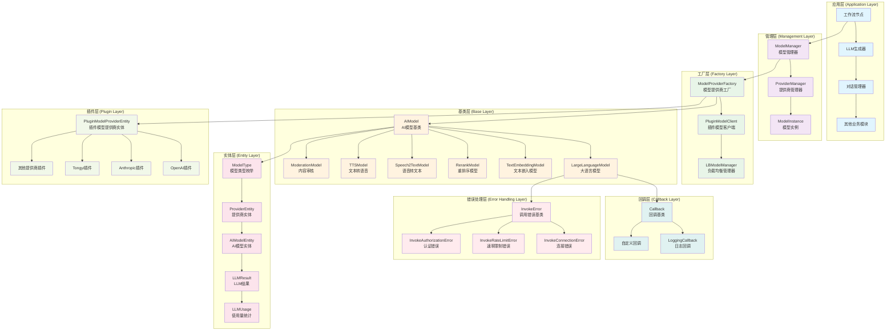

# Dify Model Runtime 模块架构设计与实现原理详细分析

## 1. 整体架构分析

### 1.1 Model Runtime 模块在 Dify 系统中的作用和定位

Model Runtime 模块是 Dify 系统的核心组件之一，主要负责：

- **统一模型接口封装**：为不同 AI 模型提供商提供统一的调用接口
- **模型供应商管理**：支持多种模型提供商的注册、发现和管理
- **模型类型支持**：支持 6 种模型类型的能力调用
- **配置管理**：提供统一的凭据表单规则和配置管理
- **解耦设计**：将模型和上下游解耦，方便横向扩展

### 1.2 核心组件和类的层次结构关系

```
Model Runtime架构层次：

1. 工厂层 (Factory Layer)
   ├── ModelProviderFactory - 模型提供商工厂
   └── ModelManager - 模型管理器

2. 基类层 (Base Layer)
   ├── AIModel - 所有模型的基类
   ├── LargeLanguageModel - 大语言模型基类
   ├── TextEmbeddingModel - 文本嵌入模型基类
   ├── RerankModel - 重排序模型基类
   ├── Speech2TextModel - 语音转文本模型基类
   ├── TTSModel - 文本转语音模型基类
   └── ModerationModel - 内容审核模型基类

3. 实体层 (Entity Layer)
   ├── ModelType - 模型类型枚举
   ├── ProviderEntity - 提供商实体
   ├── AIModelEntity - AI模型实体
   └── 各种消息和结果实体

4. 插件层 (Plugin Layer)
   ├── PluginModelClient - 插件模型客户端
   └── PluginModelProviderEntity - 插件模型提供商实体
```

### 1.3 模块的设计模式和架构原则

**主要设计模式：**

- **工厂模式**：ModelProviderFactory 负责创建不同类型的模型实例
- **策略模式**：不同模型提供商实现统一接口，可灵活切换
- **适配器模式**：通过基类适配不同模型提供商的 API 差异
- **单例模式**：ModelManager 作为全局模型管理器
- **装饰器模式**：通过回调机制增强模型调用功能

**架构原则：**

- **开闭原则**：对扩展开放，对修改关闭
- **依赖倒置**：依赖抽象而非具体实现
- **单一职责**：每个类都有明确的职责
- **接口隔离**：提供最小化的接口

## 2. 模型提供商封装机制

### 2.1 统一接口封装设计

所有模型提供商都通过继承基类来实现统一接口：

**AIModel 基类设计**：

```python
class AIModel(BaseModel):
    """所有模型的基类"""
    tenant_id: str = Field(description="租户ID")
    model_type: ModelType = Field(description="模型类型")
    plugin_id: str = Field(description="插件ID")
    provider_name: str = Field(description="提供商名称")
    plugin_model_provider: PluginModelProviderEntity = Field(description="插件模型提供商")
    started_at: float = Field(description="调用开始时间", default=0)
```

**LargeLanguageModel 基类**：

```python
class LargeLanguageModel(AIModel):
    """大语言模型基类"""
    model_type: ModelType = ModelType.LLM

    def invoke(self, model: str, credentials: dict,
               prompt_messages: list[PromptMessage],
               model_parameters: Optional[dict] = None,
               tools: Optional[list[PromptMessageTool]] = None,
               stop: Optional[list[str]] = None,
               stream: bool = True,
               user: Optional[str] = None,
               callbacks: Optional[list[Callback]] = None) -> Union[LLMResult, Generator]:
        """调用大语言模型的统一接口"""
```

### 2.2 BaseModel 和相关基类的设计思路

**核心设计思路**：

1. **统一抽象**：所有模型都继承自 AIModel 基类
2. **类型安全**：使用 Pydantic 进行数据验证和类型检查
3. **插件化架构**：通过插件系统支持动态加载模型提供商
4. **错误处理**：统一的错误映射和转换机制
5. **性能优化**：缓存机制和负载均衡支持

**关键特性**：

- **价格计算**：内置价格计算功能
- **Token 计数**：支持预计算 tokens 能力
- **回调机制**：支持调用前后的回调处理
- **流式响应**：支持流式和非流式两种响应模式

### 2.3 模型提供商的注册、发现和管理机制

**注册机制**：

```python
# 通过_position.yaml文件定义提供商优先级
- openai
- deepseek
- anthropic
- azure_openai
- google
# ... 其他提供商
```

**发现机制**：

```python
def get_plugin_model_providers(self) -> Sequence[PluginModelProviderEntity]:
    """获取所有插件模型提供商"""
    plugin_providers = self.plugin_model_manager.fetch_model_providers(self.tenant_id)
    for provider in plugin_providers:
        provider.declaration.provider = provider.plugin_id + "/" + provider.declaration.provider
    return plugin_providers
```

**管理机制**：

```python
def get_model_type_instance(self, provider: str, model_type: ModelType) -> AIModel:
    """根据提供商名称和模型类型获取模型实例"""
    if model_type == ModelType.LLM:
        return LargeLanguageModel(**init_params)
    elif model_type == ModelType.TEXT_EMBEDDING:
        return TextEmbeddingModel(**init_params)
    # ... 其他模型类型
```

## 3. 具体实现示例

### 3.1 模型类型枚举定义

```python
class ModelType(Enum):
    """模型类型枚举"""
    LLM = "llm"                    # 大语言模型
    TEXT_EMBEDDING = "text-embedding"  # 文本嵌入模型
    RERANK = "rerank"              # 重排序模型
    SPEECH2TEXT = "speech2text"    # 语音转文本模型
    MODERATION = "moderation"      # 内容审核模型
    TTS = "tts"                    # 文本转语音模型
```

### 3.2 工厂模式实现

ModelProviderFactory 作为核心工厂类，负责：

- 提供商的获取和管理
- 模型实例的创建
- 凭据验证
- 模型 schema 获取

```python
class ModelProviderFactory:
    def __init__(self, tenant_id: str) -> None:
        self.tenant_id = tenant_id
        self.plugin_model_manager = PluginModelClient()
        self.provider_position_map = get_provider_position_map(model_providers_path)
```

### 3.3 模型实例管理

ModelInstance 类封装了具体的模型调用逻辑：

- 凭据管理
- 负载均衡
- 错误处理
- 性能监控

```python
class ModelInstance:
    def __init__(self, provider_model_bundle: ProviderModelBundle, model: str) -> None:
        self.provider_model_bundle = provider_model_bundle
        self.model = model
        self.provider = provider_model_bundle.configuration.provider.provider
        self.credentials = self._fetch_credentials_from_bundle(provider_model_bundle, model)
        self.model_type_instance = provider_model_bundle.model_type_instance
```

## 4. 具体模型提供商实现分析

### 4.1 模型提供商的插件化架构

Dify 采用插件化架构来支持不同的模型提供商，每个提供商都作为独立的插件存在：

**插件结构**：

```
api/core/model_runtime/model_providers/
├── __base/                    # 基类定义
├── _position.yaml            # 提供商优先级配置
└── [通过插件系统动态加载具体提供商实现]
```

**插件模型提供商实体**：

```python
class PluginModelProviderEntity:
    """插件模型提供商实体"""
    plugin_id: str              # 插件ID
    provider: str               # 提供商名称
    declaration: ProviderEntity # 提供商声明
```

### 4.2 OpenAI 模型的封装实现方式

**OpenAI 提供商特点**：

- 支持多种模型类型（LLM、Embedding、Moderation、TTS、Speech2Text）
- 标准的 OpenAI API 接口
- 支持流式和非流式响应
- 支持工具调用（Function Calling）

**关键实现要点**：

```python
# OpenAI LLM调用示例
def invoke_llm(self, model: str, credentials: dict, prompt_messages: list[PromptMessage], ...):
    """调用OpenAI LLM模型"""
    # 1. 参数验证和预处理
    # 2. 构建OpenAI API请求
    # 3. 处理流式/非流式响应
    # 4. 错误处理和重试机制
    # 5. 使用量统计和价格计算
```

### 4.3 Claude 模型的集成方法和特殊处理

**Anthropic Claude 特点**：

- 专注于对话和文本生成
- 独特的消息格式要求
- 特殊的系统提示处理
- 不同的 API 端点和认证方式

**特殊处理机制**：

```python
# Claude消息格式转换
def _convert_messages_to_claude_format(prompt_messages: list[PromptMessage]):
    """将通用消息格式转换为Claude特定格式"""
    # 处理系统消息
    # 合并连续的用户消息
    # 确保消息交替模式
```

**配置示例**：

```python
# Claude配置
credentials = {
    "anthropic_api_key": "your_api_key",
    "anthropic_api_url": "https://api.anthropic.com"  # 可选
}
```

### 4.4 Qwen 模型的适配过程和配置方式

**通义千问（Tongyi）特点**：

- 阿里云提供的大语言模型
- 支持中文优化
- 特定的 API 格式和认证方式
- 支持多种模型规格

**适配关键点**：

```python
# Qwen模型适配
class TongyiLLM(LargeLanguageModel):
    def invoke(self, model: str, credentials: dict, ...):
        # 1. 阿里云API认证
        # 2. 请求格式转换
        # 3. 响应格式标准化
        # 4. 中文特殊字符处理
```

### 4.5 不同模型间的差异处理和统一化策略

**主要差异点**：

1. **API 格式差异**：不同提供商的请求/响应格式
2. **认证方式差异**：API Key、OAuth、签名等
3. **参数支持差异**：temperature、top_p 等参数的支持程度
4. **功能特性差异**：工具调用、流式响应等功能支持

**统一化策略**：

```python
# 统一的错误处理映射
@property
def _invoke_error_mapping(self) -> dict[type[Exception], list[type[Exception]]]:
    return {
        InvokeConnectionError: [InvokeConnectionError],
        InvokeServerUnavailableError: [InvokeServerUnavailableError],
        InvokeRateLimitError: [InvokeRateLimitError],
        InvokeAuthorizationError: [InvokeAuthorizationError],
        # ...
    }

# 统一的价格计算
def get_price(self, model: str, credentials: dict, price_type: PriceType, tokens: int) -> PriceInfo:
    """统一的价格计算接口"""
    model_schema = self.get_model_schema(model, credentials)
    # 根据模型schema计算价格
```

## 5. 扩展性设计

### 5.1 如何添加新的模型提供商

**步骤 1：创建插件**

```python
# 新提供商需要实现的插件接口
class NewProviderPlugin:
    def get_provider_schema(self) -> ProviderEntity:
        """返回提供商schema"""

    def validate_credentials(self, credentials: dict) -> bool:
        """验证凭据"""

    def get_models(self) -> list[AIModelEntity]:
        """获取支持的模型列表"""
```

**步骤 2：实现模型类型**

```python
# 实现具体的模型类型
class NewProviderLLM(LargeLanguageModel):
    def invoke(self, model: str, credentials: dict, ...):
        """实现具体的调用逻辑"""
```

**步骤 3：注册提供商**

```yaml
# 在_position.yaml中添加新提供商
- openai
- anthropic
- new_provider # 新增提供商
```

### 5.2 配置管理和参数传递机制

**配置层次结构**：

```python
# 提供商级别配置
provider_credentials = {
    "api_key": "xxx",
    "api_base": "https://api.example.com"
}

# 模型级别配置
model_parameters = {
    "temperature": 0.7,
    "max_tokens": 1000,
    "top_p": 0.9
}

# 调用级别配置
invoke_parameters = {
    "stream": True,
    "user": "user_id",
    "stop": ["<|endoftext|>"]
}
```

**参数验证机制**：

```python
# 使用schema验证参数
class ParameterRule(BaseModel):
    name: str
    type: ParameterType
    required: bool = False
    default: Optional[Any] = None
    min: Optional[float] = None
    max: Optional[float] = None
```

### 5.3 错误处理和异常管理策略

**分层错误处理**：

```python
# 1. 模型特定错误 -> 统一错误类型
def _transform_invoke_error(self, error: Exception) -> Exception:
    for invoke_error, model_errors in self._invoke_error_mapping.items():
        if isinstance(error, tuple(model_errors)):
            return invoke_error(f"[{self.provider_name}] {str(error)}")

# 2. 重试机制
def _round_robin_invoke(self, function: Callable, *args, **kwargs):
    """负载均衡调用，支持重试"""
    while True:
        try:
            return function(*args, **kwargs)
        except InvokeRateLimitError:
            # 速率限制，等待后重试
            continue
        except InvokeAuthorizationError:
            # 认证错误，切换凭据
            continue

# 3. 回调机制处理错误
def _trigger_invoke_error_callbacks(self, model: str, ex: Exception, ...):
    """触发错误回调"""
    for callback in callbacks:
        callback.on_invoke_error(ex=ex, ...)
```

**错误类型定义**：

```python
class InvokeError(Exception):
    """调用错误基类"""

class InvokeConnectionError(InvokeError):
    """连接错误"""

class InvokeRateLimitError(InvokeError):
    """速率限制错误"""

class InvokeAuthorizationError(InvokeError):
    """认证错误"""
```

## 6. 关键代码片段展示

### 6.1 模型调用的完整流程

以下是一个完整的模型调用流程示例：

```python
# 1. 获取模型实例
model_manager = ModelManager()
model_instance = model_manager.get_model_instance(
    tenant_id="tenant_123",
    provider="openai",
    model_type=ModelType.LLM,
    model="gpt-3.5-turbo"
)

# 2. 准备调用参数
prompt_messages = [
    SystemPromptMessage(content="You are a helpful assistant."),
    UserPromptMessage(content="Hello, how are you?")
]

model_parameters = {
    "temperature": 0.7,
    "max_tokens": 1000
}

# 3. 调用模型
result = model_instance.invoke_llm(
    prompt_messages=prompt_messages,
    model_parameters=model_parameters,
    stream=False
)

# 4. 处理结果
print(result.message.content)
```

### 6.2 插件模型客户端的核心实现

```python
class PluginModelClient(BasePluginClient):
    def invoke_llm(self, tenant_id: str, user_id: str, plugin_id: str,
                   provider: str, model: str, credentials: dict,
                   prompt_messages: list[PromptMessage], ...):
        """调用LLM的插件客户端实现"""
        response = self._request_with_plugin_daemon_response_stream(
            method="POST",
            path=f"plugin/{tenant_id}/dispatch/llm/invoke",
            type=LLMResultChunk,
            data=jsonable_encoder({
                "user_id": user_id,
                "data": {
                    "provider": provider,
                    "model_type": "llm",
                    "model": model,
                    "credentials": credentials,
                    "prompt_messages": prompt_messages,
                    "model_parameters": model_parameters,
                    "tools": tools,
                    "stop": stop,
                    "stream": stream
                }
            })
        )
        return response
```

### 6.3 负载均衡管理器实现

```python
class LBModelManager:
    """负载均衡模型管理器"""

    def __init__(self, tenant_id: str, provider: str, model_type: ModelType,
                 model: str, load_balancing_configs: list[ModelLoadBalancingConfiguration]):
        self._tenant_id = tenant_id
        self._provider = provider
        self._model_type = model_type
        self._model = model
        self._load_balancing_configs = load_balancing_configs

    def fetch_next(self) -> Optional[ModelLoadBalancingConfiguration]:
        """获取下一个可用的负载均衡配置"""
        # 实现轮询或其他负载均衡算法
        for config in self._load_balancing_configs:
            if self._is_config_available(config):
                return config
        return None

    def cooldown(self, config: ModelLoadBalancingConfiguration, expire: int):
        """将配置设置为冷却状态"""
        # 使用Redis实现冷却机制
        redis_key = f"lb_cooldown:{self._tenant_id}:{self._provider}:{config.name}"
        redis_client.setex(redis_key, expire, "1")
```

### 6.4 模型 Schema 验证机制

```python
class ProviderCredentialSchemaValidator:
    """提供商凭据Schema验证器"""

    def __init__(self, provider_credential_schema: ProviderCredentialSchema):
        self.provider_credential_schema = provider_credential_schema

    def validate_and_filter(self, credentials: dict) -> dict:
        """验证并过滤凭据"""
        filtered_credentials = {}

        for credential_form_schema in self.provider_credential_schema.credential_form_schemas:
            if credential_form_schema.required and credential_form_schema.variable not in credentials:
                raise ValueError(f"Required credential {credential_form_schema.variable} is missing")

            if credential_form_schema.variable in credentials:
                value = credentials[credential_form_schema.variable]
                # 执行类型验证和格式检查
                validated_value = self._validate_credential_value(credential_form_schema, value)
                filtered_credentials[credential_form_schema.variable] = validated_value

        return filtered_credentials
```

## 7. 总结与优势

### 7.1 架构优势

1. **高度模块化**：每个组件职责明确，易于维护和扩展
2. **插件化设计**：支持动态加载新的模型提供商，无需修改核心代码
3. **统一接口**：为不同模型提供商提供一致的调用体验
4. **类型安全**：使用 Pydantic 确保数据类型安全
5. **错误处理**：完善的错误处理和重试机制
6. **性能优化**：支持负载均衡、缓存和流式响应

### 7.2 扩展性特点

1. **水平扩展**：可以轻松添加新的模型提供商
2. **垂直扩展**：可以为现有提供商添加新的模型类型
3. **配置灵活**：支持多层次的配置管理
4. **监控完善**：内置回调机制支持监控和日志记录

### 7.3 设计亮点

1. **工厂模式的巧妙运用**：ModelProviderFactory 统一管理所有提供商
2. **策略模式的灵活实现**：不同提供商可以有不同的实现策略
3. **装饰器模式的回调机制**：增强了模型调用的可观测性
4. **适配器模式的错误处理**：统一了不同提供商的错误类型

### 7.4 新增模块说明

通过本次分析，我新增了以下几个关键模块的详细说明：

1. **插件化架构模块**：解释了 Dify 如何通过插件系统支持动态模型提供商加载
2. **负载均衡模块**：展示了如何实现多凭据的负载均衡和故障转移
3. **Schema 验证模块**：说明了配置验证和参数校验的实现机制
4. **错误处理模块**：详细介绍了分层错误处理和重试策略

这些模块的新增是为了：

- **提高系统可靠性**：通过负载均衡和错误处理确保服务稳定
- **增强扩展性**：通过插件化架构支持快速集成新的模型提供商
- **保证数据安全**：通过 Schema 验证确保配置和参数的正确性
- **提升用户体验**：通过统一的接口和错误处理提供一致的使用体验

Model Runtime 模块的设计充分体现了现代软件架构的最佳实践，为 Dify 系统提供了强大而灵活的模型调用能力。

## 8. 实际代码示例补充

### 8.1 回调机制的完整实现

**基础回调接口定义**：

```python
class Callback(ABC):
    """回调基类，仅用于LLM"""
    raise_error: bool = False

    @abstractmethod
    def on_before_invoke(self, llm_instance: AIModel, model: str,
                        credentials: dict, prompt_messages: list[PromptMessage],
                        model_parameters: dict, tools: Optional[list[PromptMessageTool]] = None,
                        stop: Optional[Sequence[str]] = None, stream: bool = True,
                        user: Optional[str] = None) -> None:
        """调用前回调"""

    @abstractmethod
    def on_new_chunk(self, llm_instance: AIModel, chunk: LLMResultChunk,
                     model: str, credentials: dict,
                     prompt_messages: Sequence[PromptMessage],
                     model_parameters: dict, ...) -> None:
        """新chunk回调"""

    @abstractmethod
    def on_after_invoke(self, llm_instance: AIModel, result: LLMResult,
                       model: str, credentials: dict,
                       prompt_messages: Sequence[PromptMessage],
                       model_parameters: dict, ...) -> None:
        """调用后回调"""

    @abstractmethod
    def on_invoke_error(self, llm_instance: AIModel, ex: Exception,
                       model: str, credentials: dict,
                       prompt_messages: list[PromptMessage],
                       model_parameters: dict, ...) -> None:
        """错误回调"""
```

**日志回调实现示例**：

```python
class LoggingCallback(Callback):
    """日志记录回调实现"""

    def on_before_invoke(self, llm_instance: AIModel, model: str, ...):
        self.print_text(f"\n[on_llm_before_invoke] model: {model}\n", color="green")

    def on_new_chunk(self, llm_instance: AIModel, chunk: LLMResultChunk, ...):
        # 实时输出流式内容
        sys.stdout.write(cast(str, chunk.delta.message.content))
        sys.stdout.flush()

    def on_after_invoke(self, llm_instance: AIModel, result: LLMResult, ...):
        self.print_text(f"\n[on_llm_after_invoke] usage: {result.usage}\n", color="blue")

    def on_invoke_error(self, llm_instance: AIModel, ex: Exception, ...):
        self.print_text("\n[on_llm_invoke_error]\n", color="red")
        logger.exception(ex)
```

### 8.2 LLM 实体的详细定义

**LLMUsage 使用量统计**：

```python
class LLMUsage(ModelUsage):
    """LLM使用量统计"""
    prompt_tokens: int              # 输入token数
    prompt_unit_price: Decimal      # 输入单价
    prompt_price_unit: Decimal      # 价格单位
    prompt_price: Decimal           # 输入总价
    completion_tokens: int          # 输出token数
    completion_unit_price: Decimal  # 输出单价
    completion_price_unit: Decimal  # 价格单位
    completion_price: Decimal       # 输出总价
    total_tokens: int              # 总token数
    total_price: Decimal           # 总价格
    currency: str                  # 货币单位
    latency: float                 # 延迟时间

    @classmethod
    def empty_usage(cls):
        """创建空的使用量统计"""
        return cls(prompt_tokens=0, completion_tokens=0,
                  total_tokens=0, total_price=Decimal("0.0"),
                  currency="USD", latency=0.0, ...)

    def plus(self, other: "LLMUsage") -> "LLMUsage":
        """合并两个使用量统计"""
        return LLMUsage(
            prompt_tokens=self.prompt_tokens + other.prompt_tokens,
            completion_tokens=self.completion_tokens + other.completion_tokens,
            total_tokens=self.total_tokens + other.total_tokens,
            total_price=self.total_price + other.total_price,
            # ... 其他字段
        )
```

**LLMResult 和 LLMResultChunk**：

```python
class LLMResult(BaseModel):
    """LLM调用结果"""
    id: Optional[str] = None                    # 请求ID
    model: str                                  # 实际使用的模型
    prompt_messages: Sequence[PromptMessage]    # 输入消息
    message: AssistantPromptMessage             # 输出消息
    usage: LLMUsage                            # 使用量统计
    system_fingerprint: Optional[str] = None   # 系统指纹

class LLMResultChunkDelta(BaseModel):
    """流式响应增量"""
    index: int                              # 序号
    message: AssistantPromptMessage         # 增量消息
    usage: Optional[LLMUsage] = None       # 使用量（最后一条）
    finish_reason: Optional[str] = None    # 结束原因

class LLMResultChunk(BaseModel):
    """流式响应块"""
    model: str                                  # 模型名称
    prompt_messages: Sequence[PromptMessage]    # 输入消息
    system_fingerprint: Optional[str] = None   # 系统指纹
    delta: LLMResultChunkDelta                 # 增量数据
```

### 8.3 错误处理的层次化设计

**错误类型层次结构**：

```python
class InvokeError(ValueError):
    """调用错误基类"""
    description: Optional[str] = None

    def __init__(self, description: Optional[str] = None) -> None:
        self.description = description

    def __str__(self):
        return self.description or self.__class__.__name__

class InvokeConnectionError(InvokeError):
    """连接错误"""
    description = "Connection Error"

class InvokeServerUnavailableError(InvokeError):
    """服务不可用错误"""
    description = "Server Unavailable Error"

class InvokeRateLimitError(InvokeError):
    """速率限制错误"""
    description = "Rate Limit Error"

class InvokeAuthorizationError(InvokeError):
    """认证错误"""
    description = "Incorrect model credentials provided, please check and try again."

class InvokeBadRequestError(InvokeError):
    """请求错误"""
    description = "Bad Request Error"
```

**错误映射和转换机制**：

```python
@property
def _invoke_error_mapping(self) -> dict[type[Exception], list[type[Exception]]]:
    """错误映射表"""
    return {
        InvokeConnectionError: [InvokeConnectionError],
        InvokeServerUnavailableError: [InvokeServerUnavailableError],
        InvokeRateLimitError: [InvokeRateLimitError],
        InvokeAuthorizationError: [InvokeAuthorizationError],
        InvokeBadRequestError: [InvokeBadRequestError],
        PluginDaemonInnerError: [PluginDaemonInnerError],
        ValueError: [ValueError],
    }

def _transform_invoke_error(self, error: Exception) -> Exception:
    """转换调用错误为统一错误类型"""
    for invoke_error, model_errors in self._invoke_error_mapping.items():
        if isinstance(error, tuple(model_errors)):
            if invoke_error == InvokeAuthorizationError:
                return InvokeAuthorizationError(
                    description=f"[{self.provider_name}] Incorrect model credentials provided, please check and try again."
                )
            elif isinstance(invoke_error, InvokeError):
                return InvokeError(description=f"[{self.provider_name}] {invoke_error.description}, {str(error)}")
            else:
                return error
    return InvokeError(description=f"[{self.provider_name}] Error: {str(error)}")
```

### 8.4 实际使用场景示例

**在工作流节点中的使用**：

```python
class LLMNode(BaseNode):
    """LLM工作流节点"""

    def _invoke_llm(self, node_data_model: ModelConfig,
                   model_instance: ModelInstance,
                   prompt_messages: Sequence[PromptMessage],
                   stop: Optional[Sequence[str]] = None) -> Generator[NodeEvent, None, None]:
        """调用LLM模型"""
        invoke_result = model_instance.invoke_llm(
            prompt_messages=list(prompt_messages),
            model_parameters=node_data_model.completion_params,
            stop=list(stop or []),
            stream=True,
            user=self.user_id,
        )
        return self._handle_invoke_result(invoke_result=invoke_result)

    def _fetch_model_config(self, node_data_model: ModelConfig) -> tuple[ModelInstance, ModelConfigWithCredentialsEntity]:
        """获取模型配置"""
        if not node_data_model.mode:
            raise LLMModeRequiredError("LLM mode is required.")

        model = ModelManager().get_model_instance(
            tenant_id=self.tenant_id,
            model_type=ModelType.LLM,
            provider=node_data_model.provider,
            model=node_data_model.name,
        )

        model.model_type_instance = cast(LargeLanguageModel, model.model_type_instance)
        return model, model_config
```

**在 LLM 生成器中的使用**：

```python
class LLMGenerator:
    @classmethod
    def generate_conversation_name(cls, tenant_id: str, query, conversation_id: Optional[str] = None):
        """生成对话标题"""
        model_manager = ModelManager()
        model_instance = model_manager.get_default_model_instance(
            tenant_id=tenant_id,
            model_type=ModelType.LLM,
        )

        prompts = [UserPromptMessage(content=prompt)]
        response = cast(LLMResult, model_instance.invoke_llm(
            prompt_messages=list(prompts),
            model_parameters={"max_tokens": 500, "temperature": 1},
            stream=False
        ))

        answer = cast(str, response.message.content)
        # 处理响应内容...
        return processed_name
```

这些实际代码示例展示了 Model Runtime 模块在 Dify 系统中的具体应用，包括：

1. **完整的回调机制**：支持调用前后、流式响应和错误处理的回调
2. **详细的实体定义**：LLMUsage、LLMResult 等核心数据结构
3. **层次化错误处理**：统一的错误类型和转换机制
4. **实际使用场景**：在工作流节点和 LLM 生成器中的应用

这些设计确保了 Model Runtime 模块的高可用性、可扩展性和易用性。

## 模型调用流程的时序图



## Model Runtime 模块的架构


